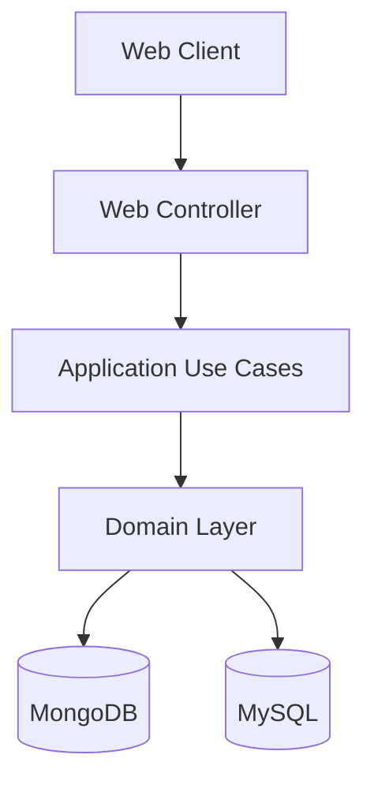

# 5.01-Advanced-Spring-Framework

## 📄 Description

This repository contains a **reactive REST API for a Blackjack game**, developed using **Spring Boot WebFlux**, **MongoDB**, and **MySQL (R2DBC)**.

The application allows managing Blackjack games and players, including game creation, gameplay actions, and player ranking persistence.

The API supports:

* Creating new Blackjack games
* Playing moves (HIT / STAND)
* Retrieving game state
* Deleting games
* Changing player names
* Viewing player rankings based on performance

Game state is stored in **MongoDB**, while player statistics and ranking are stored in **MySQL**.

The project follows a **Hexagonal Architecture (Ports & Adapters)** and **Domain-Driven Design (DDD)**, ensuring a clear separation between domain logic and infrastructure.

## 🏗️ Architecture

This project is implemented using:

* Hexagonal Architecture (Ports & Adapters)
* Domain-Driven Design (DDD)
* Reactive Programming with Spring WebFlux

Layers include:

* **Domain layer** — business logic and aggregates
* **Application layer** — use cases
* **Infrastructure layer** — persistence and controllers
* **Configuration layer** — Spring Boot, Flyway, OpenAPI

Persistence responsibilities:

* MongoDB → Game aggregate
* MySQL → Player aggregate and ranking

---
## 🧭 Architecture Diagram




## 💻 Technologies used

- Java 21
- Spring Boot
- Spring WebFlux (Reactive)
- MongoDB (Reactive persistence)
- MySQL (Reactive R2DBC)
- Flyway (Database migrations)
- Maven
- JUnit 5
- Mockito
- Spring WebFlux Test (WebTestClient)
- Lombok
- OpenAPI / Swagger (springdoc)
- Docker & Docker Compose
- IntelliJ IDEA
- Postman
- Render (Cloud deployment)

## 📋 Requirements

- Java 21
- Maven
- Docker & Docker Compose
- IDE (Intellij IDEA recommended)

## 🛠️ Installation

1. Clone the repository:

```bash
git clone https://github.com/ccasro/5.01-Advanced-Spring-Framework/
```

2. Open the project in your IDE (e.g., IntelliJ IDEA)
3. Ensure Maven dependencies are downloaded automatically

## ▶️ Execution (Docker)

Run the application with MongoDB and MySQL using Docker:

```bash
docker compose up -d
```

The API will be available at:

```arduino
http://localhost:8080
```

Swagger documentation:

```bash
http://localhost:8080/swagger-ui.html
```
▶️ Execution (Local)

Requirements:

* MongoDB running
* MySQL running

Run:

```bash
./mvnw spring-boot:run
```

## 🌐 API Endpoints

| Method | Endpoint           | Description                 |
|--------|--------------------|-----------------------------|
| POST   | /game/new          | Create a new Blackjack game |
| GET    | /game/{id}         | Retrieve game state         |
| POST   | /game/{id}/play    | Play move (HIT or STAND)    |
| DELETE | /game/{id}/delete  | Delete a game               |
| PUT    | /player/{playerId} | Change player name          |
| GET    | /ranking           | Retrieve player ranking     |

## 📖 API Documentation (Swagger)

Swagger UI:
```bash
http://localhost:8080/swagger-ui.html
```

OpenAPI specification:

```bash
http://localhost:8080/v3/api-docs
```
Swagger provides complete interactive documentation for all endpoints.

## 🧪 Testing


The project includes comprehensive unit and integration tests covering all layers of the application:

### Domain Layer Tests

Pure unit tests verify the core business logic without any framework dependencies:

- Game aggregate behavior
- Hand logic and card value calculations
- Game rules (HIT, STAND, bust, blackjack)
- Value Objects validation (PlayerName, GameId, etc.)

These tests ensure the domain logic is correct and independent of infrastructure.

### Application Layer Tests

Use case tests verify business workflows:

- CreateNewGameUseCase
- GetGameStateUseCase
- PlayMoveUseCase (HIT and STAND scenarios)
- DeleteGameUseCase
- ChangePlayerNameUseCase
- ViewRankingUseCase

Mockito is used to mock repository ports.

### Infrastructure Layer Tests

Controller tests verify REST endpoints using:

- WebTestClient
- Mocked use cases

These tests validate:

- HTTP status codes
- Request/response mapping
- Error handling via GlobalExceptionHandler

Run tests:

```bash
./mvnw test
```

## 🐳 Docker

The project includes full Docker support.

```bash
docker compose up -d --build
```

Docker services:
* Spring Boot API container
* MongoDB container
* MySQL container

Docker image available on Docker Hub:

```bash
https://hub.docker.com/r/ccasr/blackjack-api
```

Pull image:

```bash
docker pull ccasr/blackjack-api:latest
```

Run image:

```bash
docker run -p 8080:8080 ccasr/blackjack-api:latest
```

## 🗄️ Database

MongoDB stores:

* Game state
* Deck
* Hands
* Game progress

MySQL stores:

* Player information
* Wins
* Losses
* Score
* Ranking

Flyway manages database schema migrations automatically.

## ☁️ Deployment

The application is containerized and deployable to cloud platforms such as Render.

```arduino
https://blackjack-api-latest-vz8x.onrender.com
```

Swagger: 

```arduino
https://blackjack-api-latest-vz8x.onrender.com/swagger-ui.html
```


## 🤝 Contributions

* Use feature branches for development
* Follow Conventional Commits:
    * feat:
    * fix:
    * refactor:
    * test:
    * docs:
* Keep commits small and focused
* Do not commit secrets or compiled files
* Use Pull Requests for improvements

## 📌 Notes

This project demonstrates:

* Reactive REST API development
* Hexagonal Architecture
* Domain-Driven Design
* Reactive persistence with MongoDB and MySQL
* Global exception handling
* Docker containerization
* OpenAPI documentation
* Cloud deployment readiness

